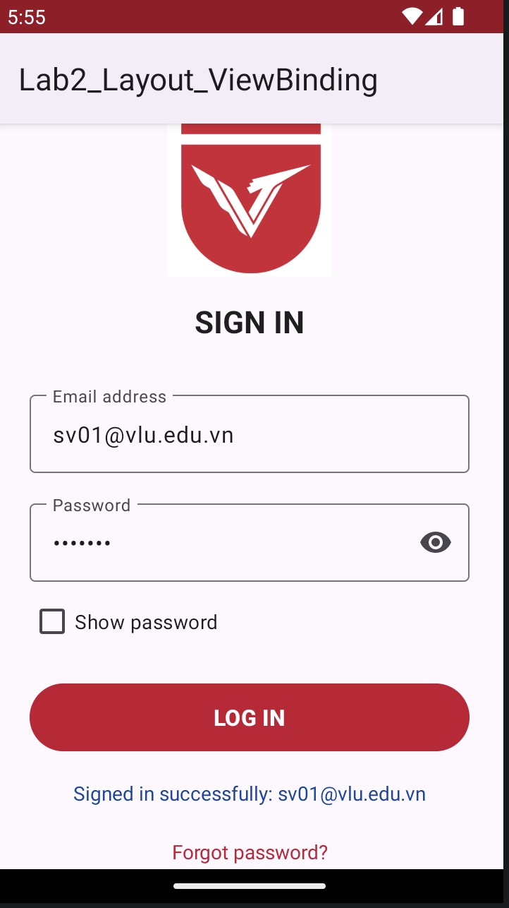
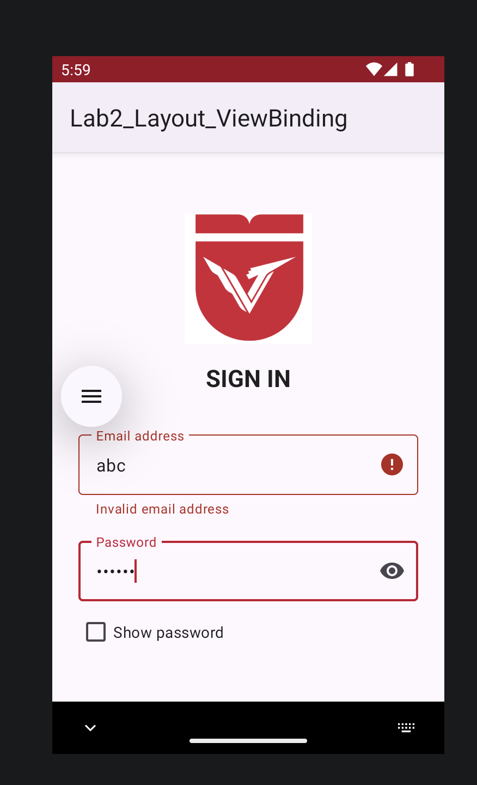
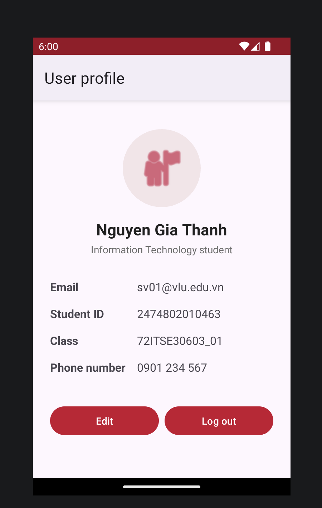

# Lab 2 – Thiết kế giao diện phẳng XML & ViewBinding

- **Sinh viên:** Nguyễn Gia Thành – **MSSV:** 2474802010463 – **Lớp:** 72ITSE30603_01
- **Package:** `vn.edu.vlu.lab2` · Kotlin · Kotlin DSL · minSdk 24 · targetSdk 34

Ứng dụng gồm 2 màn hình **Đăng nhập** và **Hồ sơ người dùng**, dựng hoàn toàn bằng
`ConstraintLayout` phẳng + **ViewBinding** (không dùng `findViewById`), mọi chuỗi nằm trong `strings.xml`.

## Đáp ứng yêu cầu

| Mã | Yêu cầu | Cách làm |
|----|---------|----------|
| R1 | Màn hình Đăng nhập (logo, tiêu đề, Email, Mật khẩu, nút, trạng thái) | `res/layout/activity_login.xml`, chuỗi neo dọc imgLogo → tvTitle → tilEmail → tilPassword → btnLogin → tvStatus |
| R2 | Kiểm tra dữ liệu | `LoginActivity.handleLogin()` dùng `when`: trống / email sai / mật khẩu < 6 ký tự |
| R3 | Đăng nhập hợp lệ | Hiện "Đăng nhập thành công: <email>" và mở `ProfileActivity` (truyền email qua Intent) |
| R4 | Profile: avatar tròn 1:1, tên, vai trò, dòng thông tin, 2 nút chia đều | `ShapeableImageView` + `DimensionRatio="H,1:1"` + `Width_percent=0.35`; Barrier; chain ngang + weight |
| R5 | ConstraintLayout + ViewBinding + strings.xml | `buildFeatures { viewBinding = true }` |
| R6 | Nộp qua GitHub | Xem mục "Nộp bài" |

## Bài tập vận dụng đã làm

**Cấp 1**
- [x] Dòng "Quên mật khẩu?" căn giữa dưới `tvStatus`, bấm hiện Toast.
- [x] Không còn chuỗi viết cứng; thêm bản tiếng Anh `res/values-en/strings.xml`.

**Cấp 2**
- [x] `res/layout-land/activity_login.xml`: Guideline dọc 40% – logo + tiêu đề bên trái, form bên phải.
- [x] CheckBox "Hiện mật khẩu" đổi `transformationMethod` của `edtPassword`.
- [x] Profile thêm dòng "Số điện thoại"; cột giá trị neo vào **Barrier** nên luôn nằm sau nhãn dài nhất.

**Cấp 3**
- [x] `TextInputLayout` + `TextInputEditText`, biểu tượng con mắt `app:endIconMode="password_toggle"`; lỗi hiển thị trên `TextInputLayout`.
- [x] Bọc layout trong `ScrollView` (`fillViewport="true"`) + `windowSoftInputMode="adjustResize"` để không bị cắt khi bàn phím hiện.
- [x] `res/layout-sw600dp/activity_login.xml`: form rộng tối đa 400dp (`layout_constraintWidth_max`), căn giữa màn hình.

> Ba biến thể layout Đăng nhập dùng **cùng bộ ID**, nên ViewBinding sinh một lớp `ActivityLoginBinding`
> duy nhất và mọi View đều non-null (riêng `guideSplit` chỉ có ở bản ngang nên là nullable – code không dùng tới).

## Cấu trúc chính

```
app/src/main/
├── AndroidManifest.xml            (LoginActivity = LAUNCHER)
├── java/vn/edu/vlu/lab2/
│   ├── LoginActivity.kt
│   └── ProfileActivity.kt
└── res/
    ├── layout/activity_login.xml          (điện thoại dọc)
    ├── layout-land/activity_login.xml     (xoay ngang)
    ├── layout-sw600dp/activity_login.xml  (tablet)
    ├── layout/activity_profile.xml
    ├── values/strings.xml, colors.xml, dimens.xml, themes.xml
    └── values-en/strings.xml
```

## Kiểm thử chức năng

| # | Email | Mật khẩu | Kết quả mong đợi |
|---|-------|----------|------------------|
| 1 | (trống) | (trống) | Toast "Vui lòng nhập email và mật khẩu", trạng thái báo thiếu dữ liệu |
| 2 | `abc` | `123456` | Lỗi "Email không hợp lệ" dưới ô Email |
| 3 | `sv01@vlu.edu.vn` | `123` | Lỗi "Mật khẩu tối thiểu 6 ký tự" |
| 4 | `sv01@vlu.edu.vn` | `123456` | "Đăng nhập thành công: sv01@vlu.edu.vn" → mở Profile, hiện đúng email |

## Kiểm thử responsive

| Tình huống | Thiết bị | Kết quả |
|-----------|----------|---------|
| Điện thoại nhỏ | Pixel 4 | ☐ Không tràn, không chồng View |
| Điện thoại lớn | Pixel 8 Pro | ☐ Bố cục cân đối |
| Xoay ngang | Rotate trên emulator | ☐ Dùng layout-land, nút ĐĂNG NHẬP vẫn bấm được |
| Máy tính bảng | Pixel Tablet | ☐ Form rộng tối đa 400dp, căn giữa |
| Chữ lớn | Cài đặt ⇒ Cỡ chữ lớn nhất | ☐ Chữ không bị cắt (cuộn được) |

## Ảnh chụp màn hình

<!-- Chụp và lưu vào thư mục screenshots/ với đúng tên dưới đây -->
| Đăng nhập | Lỗi validate | Profile |
|---|---|---|
|  |  |  |

| Xoay ngang | Tablet | Layout Inspector |
|---|---|---|
|  |  |  |

## Chạy project

1. Android Studio ⇒ **File ⇒ Open** ⇒ chọn thư mục `Lab2_Layout_ViewBinding` ⇒ đợi Gradle Sync.
2. Chọn AVD ⇒ **Shift + F10**.
